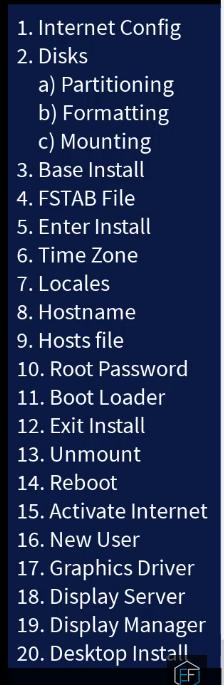

# Random-it-things

## Disbale Windows Defender in LTSC 2019

1. Go to __Settings -> Apps -> Startup__ and disable Windows Security notification icon

2. Open gpedit.msc and go to:

    - __Computer Configuration -> Administrative Templates -> Windows Components -> Windows Defender Antivirus.__ Open the Turn off Windows Defender Antivirus policy and set it as Enabled.

    - __Computer Configuration -> Administrative Templates -> Windows Components -> Windows Defender Application Guard.__ Open the Turn on Windows Defender Application Guard in Enterprise Mode policy, set it as Enabled and set it's data value to 0.

    - __Computer Configuration -> Administrative Templates -> Windows Components -> Windows Defender SmartScreen -> Explorer.__ Open the two policies there and set them both to Disabled.

    - __Computer Configuration -> Administrative Templates -> Windows Components -> Windows Defender SmartScreen -> Microsoft Edge.__ Open the first policy there and set it to Disabled.

3. Open regedit and go to:

- **HKEY_LOCAL_MACHINE\SYSTEM\CurrentControlSet\Services\SecurityHealthService**. Open the registry entry called Start and set it's data value to 4.

4. Reboot Windows and Defender will be gone forever!


## Wrong Login Screen Resolution (LightDM)

```sh
sudo gedit /usr/share/X11/xorg.conf.d/52-myres.conf
```
then in the file:
```
Section "Monitor"
    Identifier "VGA1"
    Option "PreferredMode" "1152x864"
EndSection
```
Save and exit. The values were obtained from command xrandr -q. VGA1 is the name of my connector and 1152x864 is the name of the resolution.


## Some Text Formatting

```sh
cat programs.txt | sed 's/https\?:\/\///; /Seaching for Bug/d'
cat programs.txt | sed 's/https\?:\/\///' | awk '!/Seaching for Bug/' > targtest.txt
cat programs.txt | sed 's/https\?:\/\///; /Seaching for Bug/d; /Disclosour-Search/d; s/^www.//g' | awk -F\/ '{print $1}'
cat domains_list.txt | sed  '/Seaching for Bug Bounty/d; /[*]/d; /Fuck Something/d; s/https\?:\/\///; s/^www.//g' | awk -F\/ '{print $1}'
```
## Only keep passwords that are 8 to 63 characters in length
```sh
sudo grep -x '.\{8,63\}' rockyou.txt > wparockyou.txt       
wc -l wparockyou.txt
```
## GET CIDR IPs from json
```sh
jq '.Information[] | ."CIDR Range"' mxtest.json  | tr -d \"
```
## GET ASN
```sh
ipinfo 17.253.144.10 | jq .org | tr -d \" | awk '{print $1}'
```
## Delete old commits

```sh
# Check out to a temporary branch:
git checkout --orphan TEMP_BRANCH
# Add all the files:
git add -A
# Commit the changes:
git commit -am "Initial commit"
# Delete the old branch:
git branch -D master
# Rename the temporary branch to master:
git branch -m master
# Finally, force update to our repository:
git push -f origin master
```
## Set GitHub Remove Origin 
```sh
git remote set-url origin git@github.com:mrrobot1o1/cheetsheets.git
```
## Change recent commits massage
```sh
git commit --amend -m "Initial commit"
```

## PDF Password Remove
```sh
qpdf --password=<Password_Here> --decypt Password_Protected.pdf nopassword.pdf

OR

pdftops -upw <Password_Here> Password_Protected.pdf nopassword.pdf
```


## Remove all empty line

### sed

```sh
sed '/^[[:space:]]*$/d'
sed '/^\s*$/d'
sed '/^$/d'
sed -n '/^\s*$/!p'
```
### grep

```sh
grep .
grep -v '^$'
grep -v '^\s*$'
grep -v '^[[:space:]]*$'
```
### awk

```sh
awk /./
awk 'NF'
awk 'length'
awk '/^[ \t]*$/ {next;} {print}'
awk '!/^[ \t]*$/'
```

## Install Neovim

## Dependencies
```sh
sudo apt-get install gettext libtool libtool-bin autoconf automake cmake g++ pkg-config unzip build-essential
```
===> Download compile and install
```sh
cd $(mktemp -d)
git clone https://github.com/neovim/neovim --depth 1
cd neovim
sudo make CMAKE_BUILD_TYPE=Release install
cd ..
sudo rm -r neovim
```

https://sharedby.blomp.com/pFmWz5


## Disable Touchpad  Linux
```sh
xinput set-prop "SynPS/2 Synaptics TouchPad" "Device Enabled" 0
```
## Enable Touchpad
```sh
xinput set-prop "SynPS/2 Synaptics TouchPad" "Device Enabled" 1
```

## Open Gmail with mail to Similar to MAILTO:]

https://mail.google.com/mail/u/0/?fs=1&to=test@test.com&tf=cm


https://mail.google.com/mail/?view=cm&fs=1&tf=1&to=target@email.com


## Custom PS1
```sh
export PS1="\[\e[1;32m\]john@ubuntu:\[\e[0;32m\]\w\[\e[0;35m\]\[\e[0;32m\]▶\[\e[0;37m\]"
```
## Splash Screen


## Arch Linux Install CheetSheet


```sh
#Download official iso image and boot from it

#Check if network is working or not
 ping google.com

 #Nearest mirror server (Optional)

 reflector --verbose -c "India" --sort rate > /etc/pacman.d/mirrorlist

 pacman -Syy

 #check disk

 lsblk

 cfdisk

 #Lebel dos , Primary

#Create swap partition

#Primary, Type--- Linux swap / Solaris, write then done
#check disk
fdisk -l

#Now format  root and swap partition

#Format Root
mkfs.ext4 /dev/sda1
#Swap format
mkdwap /dev/sda2
#check disks
lsblk
fdisk -l

#Now mount the Partitions

#maount root partition
mount /dev/sda1 /mnt
#check maount
lsblk
#swap on
swapon /dev/sda2
#check again
lsblk

#install basic pakages
pacstrap -i /mnt base linux linux-firmware sudo nano vi

#Now configure system

#Genrate fstab file
genfstab -U -p /mnt >> /mnt/etc/fstab
#change root in system
arch-chroot /mnt

#set local
nano /etc/locale.gen #Uncomment Your Local
locale-gen #Genrate local
#set language
echo "LANG=en_IN.UTF-8" > /etc/locale.conf
#Set TimeGone
ln -sf /usr/share/zoneinfo/Asia/Kolkata /etc/localtime

#sync time
timedatectl set-ntp true
#Set Hardware clock
hwclock --systohc
#chek date  > /etc/hostname
date
#set Hostname
echo <hostname> > /etc/hostname

#configure host file
nano /etc/hosts

#Ip Verison 4 ip set
127.0.0.1    localhost
#Ip Verion 6 ip set
::1          localhost
127.0.1.1    <hostname>.localdomain     <hostname>

#User Configration
#set root password
passwd
#Add nonroot user
useradd -m -G wheel -s /bin/bash <username>
#set user password
passwd <username>
#Give user paermission to run anycommand using sudo
#make a change in sudoers file
EDITOR=nano visudo

#uncomment group wheel to execute any command

# Uncommnet to allow members of group wheel to execute any command
# %whell ALL=(ALL) ALL

#install Grub boot loader
pacman -S grub

#install grub in disk
grub-install /dev/sda
#Generate grub configration file
grub-mkconfig -o /boot/grub/grub.cfg
#Nework manager configration
#install network manager
pacman -S networkmanger
#enable network manager service
systemctl enable NetworkManager
#Now test the installtion
exit
#Unmount root partition
umount -R /mnt

reboot
#If eveything works file install kde [boot from arch grub boot loader]

#login with root
uname -a
#install desktop environment
pacman -S xorg plasma plasma-wayland-session kde-applications konsole firefox

#Enable Display manger service
systemctl enable sddm

reboot
#############Done################
```


## Set Screen Resolution in Linux using x11 Configuration 

xrandr -q to get display name and Resolution

```sh
vim /etc/X11/xorg.conf
```
```
Section "Monitor"
    Identifier "eDP"
    Option "Primary" "true"
    Option "PreferredMode" "2560x1440"
EndSection


Section "Monitor"
    Identifier "DisplayPort-0"
    Option "RightOf" "Primary"
    Option "PreferredMode" "1920x1080"
EndSection
```

## Spin FTP Server
```sh
python3 -m pyftpdlib
```

##Check Port is Being Used by which application/command
Example: port 8080

```sh
lsof -i:8080
```

## add file for all file in current directoy

```sh
find . -type f -exec mv '{}' '{}'.jpg \;
```
